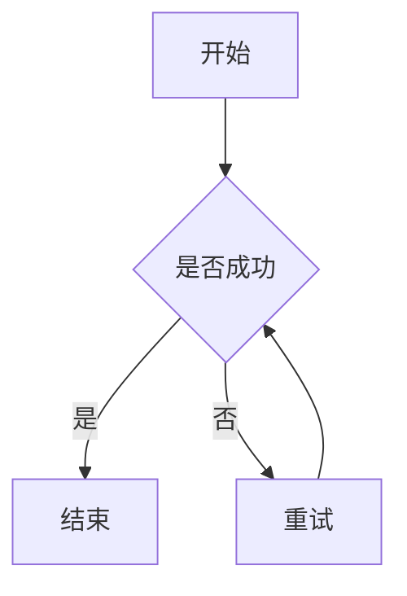

# md-mermaid-to-svg

一个用于将 Markdown 文件中的 Mermaid 图转换为 SVG 图片的简单工具。

工具会遍历 Markdown 文件中的所有 Mermaid 代码块，逐个调用 `mmdc` 生成 SVG，并在原 Mermaid 图后自动添加对应 SVG 文件的打开链接。

## 功能

- 支持处理单个 Markdown 文件。
- 支持处理一个目录，并递归遍历其中所有 `.md` 文件。
- 自动识别 Markdown 中的 Mermaid 代码块。
- 自动调用 `mmdc` 将 Mermaid 图转换为 SVG。
- 创建与 Markdown 文件同名的文件夹存放生成的 SVG 文件。
- 生成的 SVG 文件使用简化命名（`001.svg`, `002.svg`...）。
- 自动在 Mermaid 代码块后添加 SVG 链接。
- 如果之前已经生成过 SVG 链接，会根据当前 Mermaid 内容重新生成 SVG 并更新链接。
- 自动删除该工具旧版本生成、但当前已不再使用的 SVG 文件。

## 示例

转换前：

```markdown
# 示例文档


```

转换后：

```markdown
# 示例文档


<!-- mermaid-svg-link-begin -->
[打开 Mermaid SVG](./doc/001.svg)
<!-- mermaid-svg-link-end -->
```

同时会在 Markdown 文件同目录下创建文件夹并生成 SVG：

```text
doc/
└── 001.svg
```

如果一个 Markdown 文件中包含多个 Mermaid 图，会依次生成：

```text
doc/
├── 001.svg
├── 002.svg
└── 003.svg
```

## 运行环境

目标运行环境：

```text
Ubuntu
Python 3.8+
Node.js
npm
Mermaid CLI
```

本工具本身只使用 Python 标准库，不依赖第三方 Python 包。

## 安装

### 1. 安装 Node.js 和 npm

```bash
sudo apt update
sudo apt install -y nodejs npm
```

检查安装结果：

```bash
node -v
npm -v
```

### 2. 安装 Mermaid CLI

```bash
sudo npm install -g @mermaid-js/mermaid-cli
```

检查 `mmdc` 是否可用：

```bash
mmdc --version
```

### 3. 安装 Chromium

Mermaid CLI 底层依赖 Puppeteer/Chromium。推荐使用以下命令安装 Chrome：

```bash
npx puppeteer browsers install chrome
```

或者安装系统 Chromium：

```bash
sudo apt install -y \
  chromium-browser \
  fonts-noto-cjk \
  libatk-bridge2.0-0 \
  libatk1.0-0 \
  libcups2 \
  libdbus-1-3 \
  libdrm2 \
  libgbm1 \
  libgtk-3-0 \
  libnspr4 \
  libnss3 \
  libx11-xcb1 \
  libxcomposite1 \
  libxdamage1 \
  libxrandr2 \
  xdg-utils
```

其中 `fonts-noto-cjk` 用于改善中文字体显示效果。

**注意**：如果 mmdc 报告找不到 Chrome，工具会尝试自动检测 Puppeteer 缓存中的 Chrome。你也可以手动设置环境变量：

```bash
export PUPPETEER_EXECUTABLE_PATH=/path/to/chrome
```

## Python 依赖

本工具不需要第三方 Python 依赖。

`requirements.txt` 内容可以写成：

```txt
# No Python third-party dependencies.
# This tool uses Python standard library only.
```

## 使用方法

### 作为 Claude Code Skill 使用（推荐）

本工具已封装为 Claude Code Skill。安装后，只需在 Claude Code 中输入：

```
/mermaid-to-svg ./doc.md
```

或处理整个目录：

```
/mermaid-to-svg ./docs
```

### 作为独立脚本使用

#### 处理单个 Markdown 文件

```bash
python3 md_mermaid_to_svg.py ./doc.md
```

#### 处理目录下所有 Markdown 文件

```bash
python3 md_mermaid_to_svg.py ./docs
```

该命令会递归处理 `./docs` 目录下的所有 `.md` 文件。

### Skill 安装

Skill 文件位于 `.claude/skills/mermaid-to-svg/` 目录。要安装到 Claude Code：

```bash
# 方法1：使用 skill 目录路径
claude skill install .claude/skills/mermaid-to-svg/

# 方法2：打包后安装
claude skill package .claude/skills/mermaid-to-svg/
claude skill install mermaid-to-svg.skill
```

## 文件存储结构

假设输入文件为：

```text
doc.md
```

其中包含 3 个 Mermaid 图，则生成：

```text
doc/
├── 001.svg
├── 002.svg
└── 003.svg
```

如果输入文件为：

```text
compiler-notes.md
```

则生成：

```text
compiler-notes/
├── 001.svg
└── 002.svg
```

## 自动生成的链接块

工具会在每个 Mermaid 代码块后添加如下链接块：

```markdown
<!-- mermaid-svg-link-begin -->
[打开 Mermaid SVG](./doc/001.svg)
<!-- mermaid-svg-link-end -->
```

这两个 HTML 注释标记用于识别工具自动生成的链接。

再次运行工具时，会自动删除旧链接块，并根据当前 Mermaid 图重新生成 SVG 和链接。

## Mermaid 代码块格式

支持以下两种 Mermaid 代码块：

````markdown
